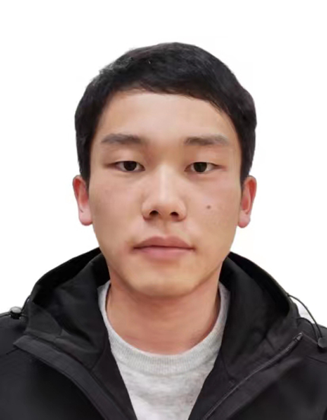

# About Me

**Ph.D. candidate**

**School of Computer Science and Information Engineering, Hefei University of Technology, Hefei, China**
   
**Email**: hfutqian@gmail.com

**Google Scholar Profile:** \[[**Google Scholar**](https://scholar.google.com/citations?user=hSaWNR0AAAAJ)\]

---

# Research Interests

<b>Computer Vision;  Model Compression;  Knowledge Distillation</b>

---

# Experience

+ 2018.09-Present, Ph.D. Candidate, School of Computer Science and Information Engineering, Hefei University of Technology.
+ 2017.09-2018.06, Master Candidate, School of Computer Science and Information Engineering, Hefei University of Technology.
+ 2013.09-2017.06, Bachelor of Engineering, School of Computer Science and Information Engineering, Hefei University of Technology.

---

# Recent Publications
+ 
<b>Adaptive Data-Free Quantization.</b>

  **Biao Qian**, Yang Wang, Richang Hong, Meng Wang\
  IEEE/CVF Conference on Computer Vision and Pattern Recognition (**CVPR**). 2023: 7960-7968.\
  \[[**Paper**](https://openaccess.thecvf.com/content/CVPR2023/papers/Qian_Adaptive_Data-Free_Quantization_CVPR_2023_paper.pdf)\]
  \[[**Code**](https://github.com/hfutqian/AdaDFQ)\]
  \[[**BibTeX**](https://scholar.googleusercontent.com/scholar.bib?q=info:h8MxtYOvhPEJ:scholar.google.com/&output=citation&scisdr=ChXGSrvpEOuuy1Zw6vI:ABFrs3wAAAAAZKt18vKqZ5fJs98f-m_jbCAShg4&scisig=ABFrs3wAAAAAZKt18q9VzuwEMqQ9KtICpvg61o0&scisf=4&ct=citation&cd=-1)\]
  

+ 
<b>Rethinking Data-free Quantization as a Zero-sum Game.</b>

  **Biao Qian**, Yang Wang, Richang Hong, Meng Wang\
  **AAAI** 2023.\
  \[[**Paper**](https://arxiv.org/pdf/2302.09572.pdf)\]
  \[[**Code**](https://github.com/hfutqian/AdaSG)\]
  \[[**BibTeX**](https://ojs.aaai.org/index.php/AAAI/citationstylelanguage/download/bibtex?submissionId=26136&publicationId=24416)\]

+ 
<b>Switchable Online Knowledge Distillation.</b>
 
  **Biao Qian**, Yang Wang, Hongzhi Yin, Richang Hong, Meng Wang\
  European Conference on Computer Vision (**ECCV**). 2022: 449-466.\
  \[[**Paper**](https://link.springer.com/chapter/10.1007/978-3-031-20083-0_27)\]
  \[[**Code**](https://github.com/hfutqian/SwitOKD)\]
  \[[**BibTeX**](https://scholar.googleusercontent.com/scholar.bib?q=info:s0PsGMaNqFwJ:scholar.google.com/&output=citation&scisdr=ChXGSrvpEOuuy1ZwDLY:ABFrs3wAAAAAZKt1FLbo6hw6mYn5X8tXgppgC9Q&scisig=ABFrs3wAAAAAZKt1FPUWeFYcOj_dKijzuM_v1zs&scisf=4)\]

+ 
<b>Diversifying inference path selection: Moving-mobile-network for landmark recognition.</b>
 
  **Biao Qian**, Yang Wang, Richang Hong, Meng Wang, Ling Shao\
  **IEEE Transactions on Image Processing**, 2021, 30: 4894-4904.\
  \[[**Paper**](https://ieeexplore.ieee.org/stamp/stamp.jsp?tp=&arnumber=9423528)\]
  \[[**Code**](https://github.com/hfutqian/Diversifying-Inference-Path-Selection-Moving-Mobile-Network-for-Landmark-Recognition)\]
  \[[**BibTeX**](https://scholar.googleusercontent.com/scholar.bib?q=info:J6DjfWco3joJ:scholar.google.com/&output=citation&scisdr=ChXGSrvpEOuuy1ZwQkQ:ABFrs3wAAAAAZKt1WkRhvdsZldN3h5uirDLvCcs&scisig=ABFrs3wAAAAAZKt1WsmoRkcJad_aS9rqLR-HyHU&scisf=4)\]

+ 
<b>Fine-grained Cross-modal Fusion based Refinement for Text-to-Image Synthesis.</b>
 
  Haoran Sun, Yang Wang, Haipeng Liu, **Biao Qian**, Meng Wang\
  **Chinese Journal of Electronics** (2023).\
  \[[**Paper**](https://arxiv.org/pdf/2302.08706.pdf)\]
  \[[**Code**](https://github.com/haoranhfut/FF-GAN)\]

---

# Services

---

# Invited Talks
+ 
<b>AI TIME Youth PhD Talk</b> (June 2022)

  
  **Title**: Switchable Online Knowledge Distillation.

---

