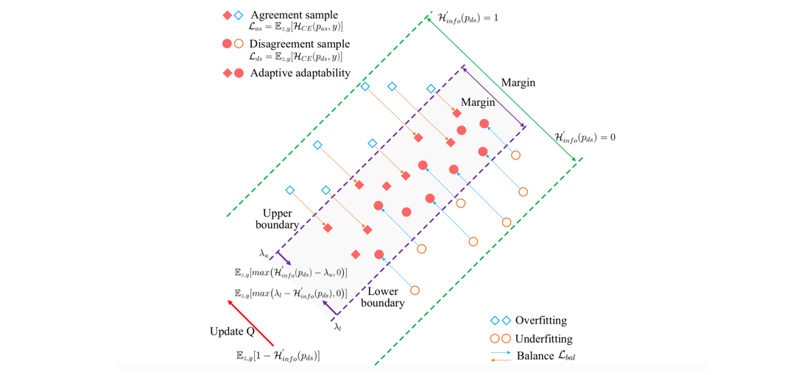

# About Me

**Research Assistant**

**School of Computer Science and Information Engineering, Hefei University of Technology, Hefei, China**
   
**E-mail**: hfutqian@gmail.com

**GitHub**: github.com/hfutqian

**Google Scholar Profile:** \[[**Google Scholar**](https://scholar.google.com/citations?user=hSaWNR0AAAAJ)\]

---

# Research Interests

<b>Knowledge Distillation; Generative AI; Network Quantization; Model Compression; Computer Vision </b>

---

# Education and Experiences

+ 2023.12-Present, **Research Assistant**, School of Computer Science and Information Engineering, Hefei University of Technology, China.

+ 2018.09-2023.12, **Ph.D. Candidate** in Signal and Information Processing, School of Computer Science and Information Engineering, Hefei University of Technology, China.

+ 2017.09-2018.06, **Master Candidate** in Signal and Information Processing, School of Computer Science and Information Engineering, Hefei University of Technology, China.

+ 2013.09-2017.06, **Bachelor of Engineering**  in Electronic Information Engineering, School of Computer Science and Information Engineering, Hefei University of Technology, China.

---

# Recent Publications

+ 
<b>Unpacking the Gap Box Against Data-Free Knowledge Distillation.</b>
 
  Yang Wang, **Biao Qian**, Haipeng Liu, Yong Rui, Meng Wang*.\
  IEEE Transactions on Pattern Analysis and Machine Intelligence (**T-PAMI**). 2024.\
  \[[**Paper**](https://ieeexplore.ieee.org/document/10476709)\]
  \[[**Code**](https://github.com/hfutqian/GapSSG)\]

   
   

+ 
<b>Adaptive Data-Free Quantization.</b>

  **Biao Qian**, Yang Wang*, Richang Hong, Meng Wang.\
  IEEE Conference on Computer Vision and Pattern Recognition (**CVPR**). 2023: 7960-7968.\
  \[[**Paper**](https://openaccess.thecvf.com/content/CVPR2023/papers/Qian_Adaptive_Data-Free_Quantization_CVPR_2023_paper.pdf)\]
  \[[**Code**](https://github.com/hfutqian/AdaDFQ)\]
  \[[**BibTeX**](https://scholar.googleusercontent.com/scholar.bib?q=info:h8MxtYOvhPEJ:scholar.google.com/&output=citation&scisdr=ChXGSrvpEOuuy1Zw6vI:ABFrs3wAAAAAZKt18vKqZ5fJs98f-m_jbCAShg4&scisig=ABFrs3wAAAAAZKt18q9VzuwEMqQ9KtICpvg61o0&scisf=4&ct=citation&cd=-1)\]

 
 
 

+ 
<b>Rethinking Data-Free Quantization as a Zero-Sum Game.</b>

  **Biao Qian**, Yang Wang*, Richang Hong, Meng Wang.\
  Proceedings of the AAAI Conference on Artificial Intelligence (**AAAI**), 2023: 9489-9497.\
  \[[**Paper**](https://arxiv.org/pdf/2302.09572.pdf)\]
  \[[**Code**](https://github.com/hfutqian/AdaSG)\]
  \[[**BibTeX**](https://ojs.aaai.org/index.php/AAAI/citationstylelanguage/download/bibtex?submissionId=26136&publicationId=24416)\]

 
 
 

+ 
<b>Switchable Online Knowledge Distillation.</b>
 
  **Biao Qian**, Yang Wang*, Hongzhi Yin, Richang Hong, Meng Wang.\
  European Conference on Computer Vision (**ECCV**). 2022: 449-466.\
  \[[**Paper**](https://link.springer.com/chapter/10.1007/978-3-031-20083-0_27)\]
  \[[**Code**](https://github.com/hfutqian/SwitOKD)\]
  \[[**BibTeX**](https://scholar.googleusercontent.com/scholar.bib?q=info:s0PsGMaNqFwJ:scholar.google.com/&output=citation&scisdr=ChXGSrvpEOuuy1ZwDLY:ABFrs3wAAAAAZKt1FLbo6hw6mYn5X8tXgppgC9Q&scisig=ABFrs3wAAAAAZKt1FPUWeFYcOj_dKijzuM_v1zs&scisf=4)\]

 
 

+ 
<b>Diversifying Inference Path Selection: Moving-Mobile-Network for Landmark Recognition.</b>
 
  **Biao Qian**, Yang Wang*, Richang Hong, Meng Wang, Ling Shao.\
  IEEE Transactions on Image Processing (**T-IP**), 2021, 30: 4894-4904.\
  \[[**Paper**](https://ieeexplore.ieee.org/stamp/stamp.jsp?tp=&arnumber=9423528)\]
  \[[**Code**](https://github.com/hfutqian/Diversifying-Inference-Path-Selection-Moving-Mobile-Network-for-Landmark-Recognition)\]
  \[[**BibTeX**](https://scholar.googleusercontent.com/scholar.bib?q=info:J6DjfWco3joJ:scholar.google.com/&output=citation&scisdr=ChXGSrvpEOuuy1ZwQkQ:ABFrs3wAAAAAZKt1WkRhvdsZldN3h5uirDLvCcs&scisig=ABFrs3wAAAAAZKt1WsmoRkcJad_aS9rqLR-HyHU&scisf=4)\]

 

+ 
<b>Structure Matters: Tackling the Semantic Discrepancy in Diffusion Models for Image Inpainting.</b>
 
  Haipeng Liu, Yang Wang*, **Biao Qian**, Meng Wang, Yong Rui.\
  IEEE Conference on Computer Vision and Pattern Recognition (**CVPR**). 2024.\
  \[[**Code**](https://github.com/htyjers/StrDiffusion)\]

   
   

+ 
<b>Seeking False Hard Negatives for Graph Contrastive Learning.</b>
 
  Xin Liu, **Biao Qian**, Haipeng Liu, Yang Wang, Meng Wang.\
  IEEE Transactions on Circuits and Systems for Video Technology (**T-CSVT**). 2024.\
  \[[**Paper**](https://ieeexplore.ieee.org/stamp/stamp.jsp?tp=&arnumber=10445278)\]
  

   
   

+ 
<b>Fine-grained Cross-modal Fusion based Refinement for Text-to-Image Synthesis.</b>
 
  Haoran Sun, Yang Wang*, Haipeng Liu, **Biao Qian**, Meng Wang.\
  **Chinese Journal of Electronics** (2023).\
  \[[**Paper**](https://arxiv.org/pdf/2302.08706.pdf)\]
  \[[**Code**](https://github.com/haoranhfut/FF-GAN)\]
  \[[**BibTeX**](https://scholar.googleusercontent.com/scholar.bib?q=info:Yqsn9LLk9esJ:scholar.google.com/&output=citation&scisdr=ClEtl_IEELH7wXgYBd4:AFWwaeYAAAAAZe0eHd5tkD9wSt9Pe1Z6r5lbBYc&scisig=AFWwaeYAAAAAZe0eHSgjCW0y_iwCGIiAkXsRScc&scisf=4&ct=citation&cd=-1&scfhb=1)\]

   
   

---

# Invited Talks
+ 
<b>CVPR 2023 Poster Presentation of Accepted Paper</b> (in person, June 2023)

  
  **Title**:  Adaptive Data-Free Quantization.

   
  
+ 
<b>AAAI 2023 Oral Presentation of Accepted Paper</b> (online, February 2023)

  **Machine Learning: Learning on the Edge & Model Compression**
  
  **Title**:  Rethinking Data-Free Quantization as a Zero-Sum Game.

   

+ 
<b>AI TIME Youth PhD Talk for Accepted Papers by ECCV 2022</b> (online, June 2022)

  
  **Title**: Switchable Online Knowledge Distillation.
  
  **Video**: https://b23.tv/G62WhP6

---

# Academic Services

+ 
<b>Reviewers</b>

  **Conferences**: CVPR, AAAI, ACM MM, IJCAI, ICMR, EMNLP, etc
  
  **Journals**: TPAMI, TIP, TOIS, TNNLS, TCSVT, CVIU, TMM, TOMM, etc.
  

---

